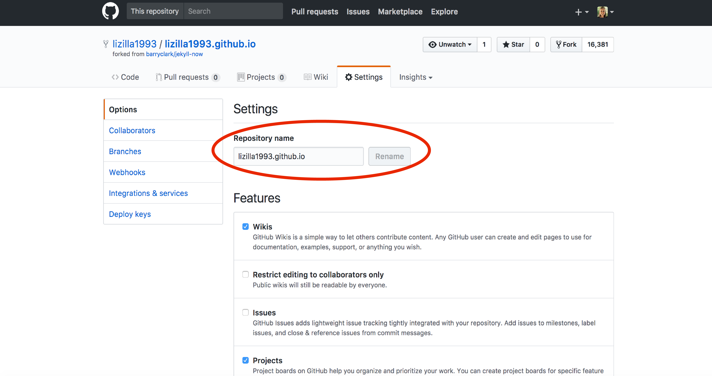
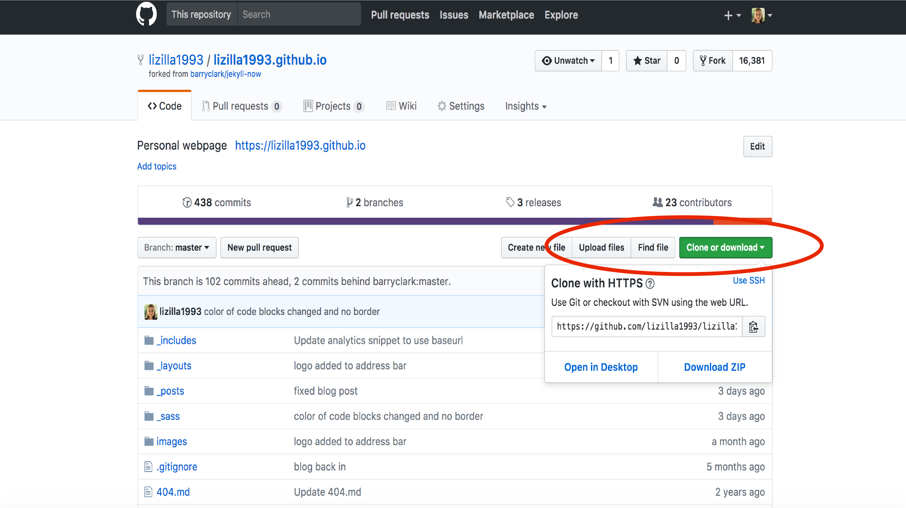

GitHub is a code hosting platform for version control and collaboration. You can work on your own projects with version control and work with collaborators more effectively, from anywhere. We learned local git which can be used with or without GitHub, this is just the hosting platform. GitHub makes it easy for others to view, use, and make modifications to your code. You can create repositories that are linked to local directories for tracking your code, or for others to fork. Additionally with a ".edu" email address, you can have unlimited private repositories for _free_! This is really nice if you want to use GitHub for hosting your project repositories but don't want the entire world to see your work. You can also have organization GitHub accounts that are set to private, such as lab accounts that only invited lab members can see. To request a discounted GitHub account, go [here](https://education.github.com/discount_requests/new). 

GitHub Pages is a static site hosting service that hosts your website directly from a GitHub repository in which you edit and push your changes from. You can create and publish GitHub pages online using Jekyll's themes, or work locally through the command line. GitHub pages can be used to host user, organization, or project website. You are allowed one page per user, and unlimited project pages per user/organization. There are several templates which you can fork/clone from directly on Github, and therefore don't have to know a lick of HTML/CSS. This lesson is to show you how you can easily get up and running with virtually any template to launch your personal website with Jekyll/GitHub Pages. 

[Jekyll](https://jekyllrb.com/) is used to generate your site from plain text to a static website, and [GitHub Pages](https://pages.github.com/) hosts the generated website. There are several [Jekyll Themes](http://jekyllthemes.org/) that you can choose from. For today, we will be working with the [Jekyll Now](http://www.jekyllnow.com/) theme designed by Barry Clark. It's a really quick and easy way to get up and running with a personal website and blog. 

The first element of creating your website from a template is forking the template repository to your own GitHub repository, and giving it a specific name so that GitHub pages knows where to build the repository to. Go to the [Jekyll Now GitHub repository](https://github.com/barryclark/jekyll-now). Get started by following these steps:

**1. To fork the repository we need to click the 'fork' button in the upper right hand corner of the repository we are interested in.** 


**2. Next we will go to the settings page in our version of the forked repository in order to change the name of the repository. As is we would have to make modifications to have it render at _yourusername.github.io/jekyll-now_ but we want it to be part of the main webpage.**




**3. Change the name of the repository to _yourusername.github.io_:**


The name of this repository _must_ follow this format in order to render correctly. 

**4. Voila! A functional static site at your specific address. Now to personalize it!**

Before we start personalizing the Jekyll Now template, there are two ways you can go about it. You can either work through the command line using Jekyll, or work directly in GitHub Pages. We will show you both approaches, starting with the command line approach to practice the git tools we learned in the first half of the workshop. To do so, `cd` into a directory where you want to work on your website in. This can be your Desktop or any directory of your choosing. We will want to "clone" the repository from GitHub to our local computer. The git command `clone` will both set up the connections to our GitHub version of the repository and pull down files from the repository. To clone the directory, click on the green clone/download button in your website repository and copy the url shown. You can do so by clicking the click board button or highlighting the address and using the copy command on your computer. 



Once you are in the directory of your choosing, type in the following command: 

```
git clone https://github.com/USERNAME/USERNAME.github.io.git
```


Where the third argument is the copied address from before or you replace USERNAME with your GitHub username. Now we can edit the Jekyll Now template from the command line. This allows us to build the static site at a temporary server on our computer thus allowing us to play around with the site before committing and pushing our changes to make the final version online. 

