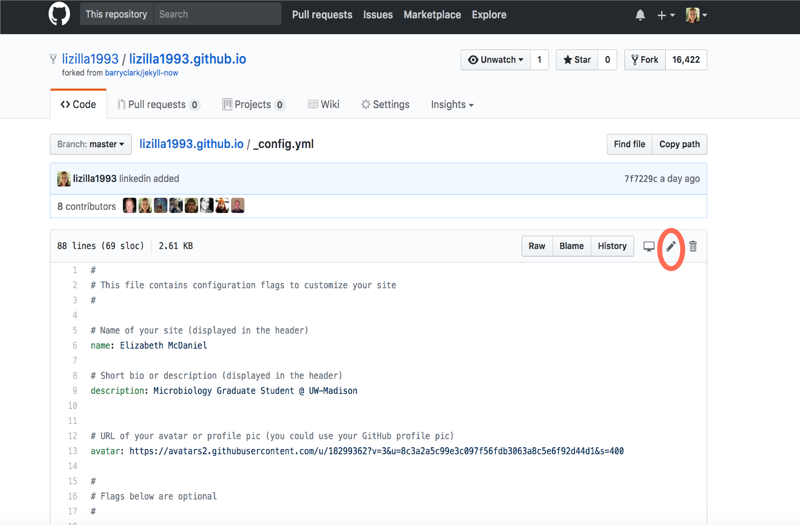
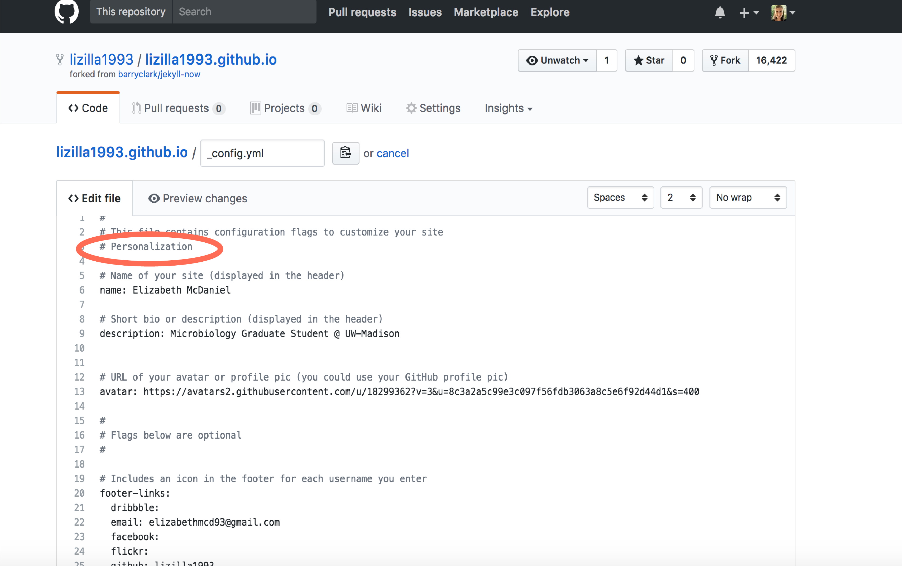

Instead of using git to add, commit, and push changes to your website and view the changes with Jekyll, you can also make changes directly within GitHub. Go to the repository on GitHub that has your website, the repository named **yourusername.github.io**. Click on the `_config.yml` file that we have been working on previously with our personalized information. Click on the pencil icon:

This will show you the raw file just like you saw in the text editor:

Here I have made a change in the form of a comment, which won't change the rendered file, but just to show what making a change does:

After you are satisfied with your changes, scroll to the bottom of the page. A green "commit changes" button will become available when you have altered the file. Give the comment a brief name and description that describes what you did to change the file:

This is essentially the same process as using git in the command line. However, you can only work on one file at a time, which leads to more commits, and more individual renderings of your website. You also can't view the changes before you commit, which you do with the Jekyll generator in the command line. However, if you are making a quick change and don't want to deal withe command line, this is a suitable option. 

We can also take a look at the breadth of available [Jekyll Templates](http://jekyllthemes.org/), and how each one implements the same elements that we have shown throughout this workshop. 